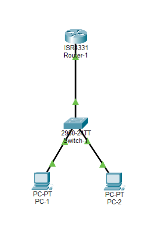
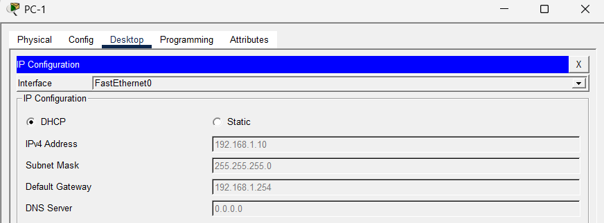
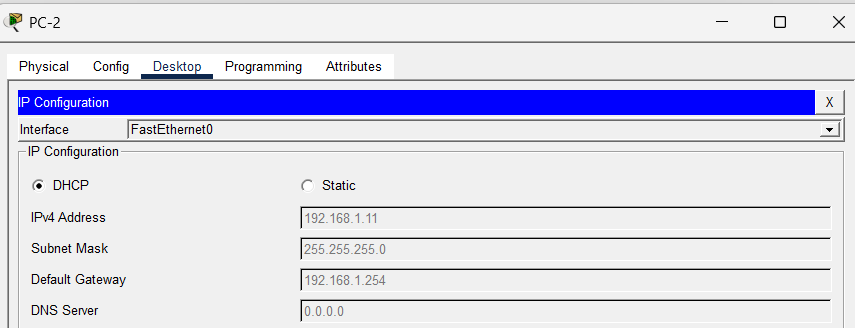

# 🌐 Lab réseau - Attribution IP avec DHCP

## 🎯 Objectif
Mettre en place un serveur DHCP sur un routeur afin d’automatiser l’attribution des adresses IP et permettre la communication entre deux réseaux.

---

## 🧱 Topologie réseau

- 2 PC (clients)
- 1 switch
- 1 routeur

---

## 🌐 Contexte et fonctionnement

Dans ce lab, le routeur joue le rôle de serveur DHCP.  
Il attribue automatiquement aux machines du réseau :

- une adresse IP
- un masque de sous-réseau
- une passerelle (gateway)

Chaque réseau dispose de son propre pool DHCP.

---

## ⚙️ Configuration du routeur (CLI)

### 🔹 1. Activation des interfaces

enable  
configure terminal  

interface gigabitethernet 0/0/0  
ip address 192.168.1.254 255.255.255.0  
no shutdown  
exit  

interface gigabitethernet 0/0/1  
ip address 192.168.2.254 255.255.255.0  
no shutdown  
exit  

---

### 🔹 2. Configuration du DHCP

#### Exclusion d’adresses (réservées)

ip dhcp excluded-address 192.168.1.1 192.168.1.9  
ip dhcp excluded-address 192.168.2.1 192.168.2.9  

#### Pool DHCP - Réseau 1

ip dhcp pool RESEAU1  
network 192.168.1.0 255.255.255.0  
default-router 192.168.1.254  
exit  

#### Pool DHCP - Réseau 2

ip dhcp pool RESEAU2  
network 192.168.2.0 255.255.255.0  
default-router 192.168.2.254  
exit  

end  

---

## 🧪 Vérifications et commandes utiles

show ip interface brief  
show ip dhcp pool  

Ces commandes permettent de :
- vérifier l’état des interfaces
- contrôler le bon fonctionnement du DHCP

---

## 🖥️ Résultat côté clients

Les postes sont configurés en DHCP et reçoivent automatiquement une adresse IP.

### PC1

### PC2

---

## 📈 Résultat

Les deux machines obtiennent automatiquement une configuration IP valide et peuvent communiquer entre elles.

---

## ⚠️ Problèmes rencontrés

- Attribution d’une adresse IP en 169.254.x.x  
  → Le DHCP ne fonctionnait pas correctement

- Interfaces du routeur désactivées  
  → Oubli de la commande `no shutdown`

---

## 🔧 Résolution

- Activation des interfaces du routeur
- Vérification avec la commande `show ip interface brief`
- Reconfiguration DHCP côté clients

---

## 🧠 Compétences développées

- Configuration d’un serveur DHCP
- Compréhension du fonctionnement DHCP
- Automatisation réseau
- Diagnostic et résolution de problèmes réseau
- Utilisation du CLI Cisco

---

## 📁 Fichiers

- lab-dhcp-attribution-ip.pkt  
- topologie-dhcp.png  
- dhcp-pc1.png  
- dhcp-pc2.png  
